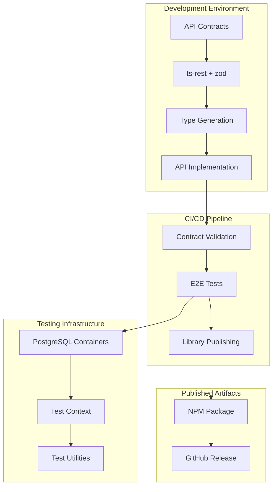

# API Design System - Design Document

## Overview

The API Design System will establish a robust, type-safe foundation for the FarmPro platform's backend services. The system combines JSON API specification compliance with modern TypeScript tooling (ts-rest and zod) to create a developer-friendly API development experience. The design emphasizes automation, testing reliability, and maintainability through contract-first development and comprehensive testing infrastructure.

## Architecture

### High-Level Architecture



### Contract-First Development Flow

1. **Contract Definition**: APIs are defined using ts-rest contracts with zod schemas
2. **Type Generation**: TypeScript types are automatically generated from contracts
3. **Implementation**: Backend services implement the contracts with full type safety
4. **Validation**: Runtime validation ensures requests/responses match contracts
5. **Testing**: E2E tests validate both contract compliance and business logic
6. **Publishing**: Contracts are automatically published as a consumable library

## Components and Interfaces

### 1. Contract Definition Layer

**Core Components:**
- `ApiContract`: Main contract definition using ts-rest
- `ZodSchemas`: Validation schemas for all data types
- `JsonApiTypes`: JSON API compliant type definitions
- `ErrorSchemas`: Standardized error response schemas

**Key Interfaces:**

```typescript
// Core contract structure
interface FarmProApiContract {
  farms: FarmEndpoints;
  commodities: CommodityEndpoints;
  orders: OrderEndpoints;
  users: UserEndpoints;
}

// JSON API resource structure
interface JsonApiResource<T> {
  data: {
    id: string;
    type: string;
    attributes: T;
    relationships?: Record<string, JsonApiRelationship>;
  };
  included?: JsonApiResource<any>[];
  meta?: Record<string, any>;
  links?: JsonApiLinks;
}

// Error response structure
interface JsonApiError {
  id?: string;
  status: string;
  code?: string;
  title: string;
  detail?: string;
  source?: {
    pointer?: string;
    parameter?: string;
  };
}
```

### 2. Validation Layer

**Components:**
- `ValidationPipe`: NestJS pipe for validating requests against zod schemas
- `ResponseInterceptor`: Ensures responses match contract specifications
- `JsonApiValidator`: Validates JSON API compliance
- `GlobalExceptionFilter`: Transforms validation errors to JSON API format

**Integration Points:**
- NestJS pipes and guards for request/response validation
- Global exception filters for consistent error responses
- Custom decorators for contract validation

### 3. Testing Infrastructure

**Core Components:**
- `TestContext`: Reusable test setup and teardown utilities
- `DatabaseManager`: PostgreSQL container lifecycle management with Prisma
- `TestDataFactory`: Factory methods for generating test data using Prisma models
- `ApiTestClient`: Type-safe API client for testing NestJS application

**TestContext Interface:**

```typescript
class TestContext {
  // Database management
  async setupDatabase(): Promise<void>;
  async cleanupDatabase(): Promise<void>;
  async resetDatabase(): Promise<void>;
  
  // Prisma client access
  get prisma(): PrismaClient;
  
  // Test data factories
  createFarm(overrides?: Partial<Prisma.FarmCreateInput>): Promise<Farm>;
  createUser(overrides?: Partial<Prisma.UserCreateInput>): Promise<User>;
  createOrder(overrides?: Partial<Prisma.OrderCreateInput>): Promise<Order>;
  
  // NestJS app instance
  get app(): INestApplication;
  
  // Utilities
  async seedTestData(scenario: TestScenario): Promise<void>;
  async waitForAsyncOperation(operation: Promise<any>): Promise<void>;
}
```

### 4. Publishing System

**Components:**
- `ContractExtractor`: Extracts contracts for library publishing
- `TypeGenerator`: Generates TypeScript definitions
- `PackageBuilder`: Builds NPM package with proper metadata
- `VersionManager`: Handles semantic versioning based on contract changes

**Publishing Pipeline:**
1. Contract change detection
2. Semantic version calculation
3. Package building and testing
4. NPM publishing
5. GitHub release creation
6. Documentation generation

## Data Models

### JSON API Resource Models

**Farm Resource:**
```typescript
const FarmSchema = z.object({
  name: z.string().min(1).max(255),
  location: z.object({
    latitude: z.number(),
    longitude: z.number(),
    address: z.string()
  }),
  size: z.number().positive(),
  cropTypes: z.array(z.string()),
  establishedDate: z.string().datetime(),
  certifications: z.array(z.string()).optional()
});

type Farm = z.infer<typeof FarmSchema>;
```

**Commodity Resource:**
```typescript
const CommoditySchema = z.object({
  name: z.string().min(1).max(255),
  category: z.enum(['grain', 'vegetable', 'fruit', 'livestock']),
  variety: z.string().optional(),
  qualityGrade: z.enum(['premium', 'standard', 'utility']),
  quantity: z.number().positive(),
  unit: z.enum(['bushel', 'pound', 'ton', 'head']),
  harvestDate: z.string().datetime(),
  storageLocation: z.string()
});

type Commodity = z.infer<typeof CommoditySchema>;
```

**Order Resource:**
```typescript
const OrderSchema = z.object({
  orderType: z.enum(['buy', 'sell']),
  commodityId: z.string().uuid(),
  quantity: z.number().positive(),
  pricePerUnit: z.number().positive(),
  totalPrice: z.number().positive(),
  deliveryDate: z.string().datetime(),
  deliveryLocation: z.string(),
  status: z.enum(['pending', 'confirmed', 'in_transit', 'delivered', 'cancelled']),
  terms: z.object({
    paymentMethod: z.enum(['cash', 'credit', 'escrow']),
    deliveryTerms: z.string(),
    qualityRequirements: z.string().optional()
  })
});

type Order = z.infer<typeof OrderSchema>;
```

### Relationship Models

**JSON API Relationships:**
```typescript
const FarmRelationships = {
  owner: {
    data: { type: 'users', id: string }
  },
  commodities: {
    data: Array<{ type: 'commodities', id: string }>
  },
  orders: {
    data: Array<{ type: 'orders', id: string }>
  }
};
```

## Error Handling

### Error Classification

**Validation Errors (400):**
- Schema validation failures
- Required field violations
- Data type mismatches
- Business rule violations

**Authentication Errors (401/403):**
- Missing authentication
- Invalid credentials
- Insufficient permissions

**Resource Errors (404/409):**
- Resource not found
- Resource conflicts
- Relationship violations

**Server Errors (500):**
- Database connection failures
- External service failures
- Unexpected application errors

### Error Response Format

```typescript
const ErrorResponseSchema = z.object({
  errors: z.array(z.object({
    id: z.string().uuid().optional(),
    status: z.string(),
    code: z.string().optional(),
    title: z.string(),
    detail: z.string().optional(),
    source: z.object({
      pointer: z.string().optional(),
      parameter: z.string().optional()
    }).optional(),
    meta: z.record(z.any()).optional()
  }))
});
```

### Error Handling Middleware

```typescript
interface ErrorHandler {
  handleValidationError(error: ZodError): JsonApiErrorResponse;
  handleDatabaseError(error: DatabaseError): JsonApiErrorResponse;
  handleAuthenticationError(error: AuthError): JsonApiErrorResponse;
  handleGenericError(error: Error): JsonApiErrorResponse;
}
```

## Testing Strategy

### Test Categories

**Unit Tests:**
- Zod schema validation
- Contract type checking
- Utility function testing
- Error handling logic

**Integration Tests:**
- Database operations
- External service integrations
- Authentication flows
- Business logic validation

**End-to-End Tests:**
- Complete API workflows
- Multi-resource operations
- Error scenario testing
- Performance validation

### Test Infrastructure Design

**PostgreSQL Container Management:**
```typescript
class DatabaseTestManager {
  private container: PostgreSqlContainer;
  private prisma: PrismaClient;
  
  async startContainer(): Promise<void>;
  async stopContainer(): Promise<void>;
  async resetDatabase(): Promise<void>;
  async runMigrations(): Promise<void>;
  async seedTestData(scenario: TestScenario): Promise<void>;
  getConnectionUrl(): string;
  getPrismaClient(): PrismaClient;
}
```

**Test Data Factory Pattern:**
```typescript
class TestDataFactory {
  static createFarm(overrides?: Partial<Farm>): Farm;
  static createUser(role: UserRole, overrides?: Partial<User>): User;
  static createOrder(type: OrderType, overrides?: Partial<Order>): Order;
  static createTestScenario(name: string): TestScenario;
}
```

**API Test Client:**
```typescript
class ApiTestClient {
  constructor(private app: INestApplication, private authToken?: string);
  
  // Type-safe API methods using supertest with NestJS
  farms: FarmApiClient;
  commodities: CommodityApiClient;
  orders: OrderApiClient;
  users: UserApiClient;
  
  // Utility methods
  authenticate(credentials: LoginCredentials): Promise<AuthToken>;
  setAuthToken(token: string): void;
  expectJsonApiResponse<T>(response: supertest.Response): Promise<JsonApiResource<T>>;
  request(): supertest.SuperTest<supertest.Test>;
}
```

### Test Execution Strategy

**Parallel Test Execution:**
- Each test suite gets isolated database container
- Tests within suite run sequentially for data consistency
- Container cleanup handled automatically

**Test Data Management:**
- Factory methods for consistent test data creation
- Scenario-based test data seeding
- Automatic cleanup between tests

**Assertion Helpers:**
- JSON API response validation
- Schema compliance checking
- Relationship integrity verification

## Implementation Phases

### Phase 1: Foundation (Weeks 1-2)
- Set up project structure and dependencies
- Implement core zod schemas and ts-rest contracts
- Create basic JSON API response utilities
- Set up testing infrastructure with PostgreSQL containers

### Phase 2: Core API Implementation (Weeks 3-4)
- Implement CRUD operations for core resources
- Add request/response validation middleware
- Create comprehensive error handling system
- Develop TestContext and test utilities

### Phase 3: Advanced Features (Weeks 5-6)
- Implement JSON API relationships and includes
- Add pagination and filtering capabilities
- Create comprehensive test suites for all endpoints
- Set up contract publishing pipeline

### Phase 4: Integration & Polish (Weeks 7-8)
- Integrate with CI/CD pipeline
- Add automated contract publishing
- Performance optimization and monitoring
- Documentation and developer guides

This design provides a solid foundation for building a robust, type-safe API system that meets all the specified requirements while maintaining flexibility for future enhancements.
